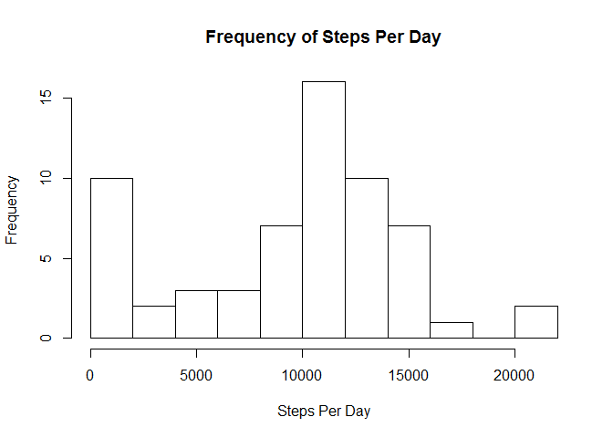
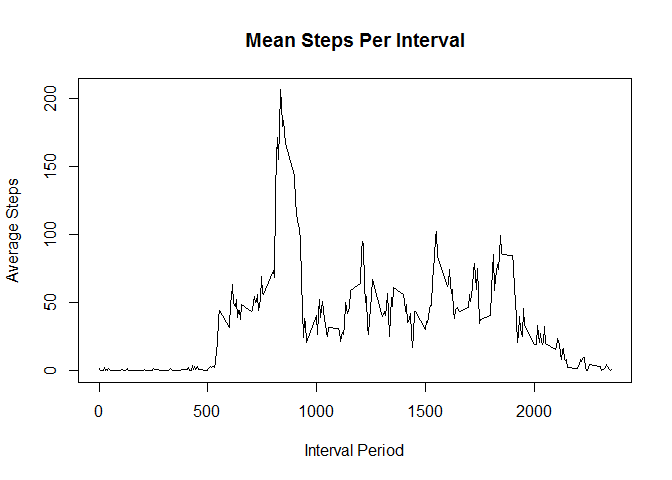
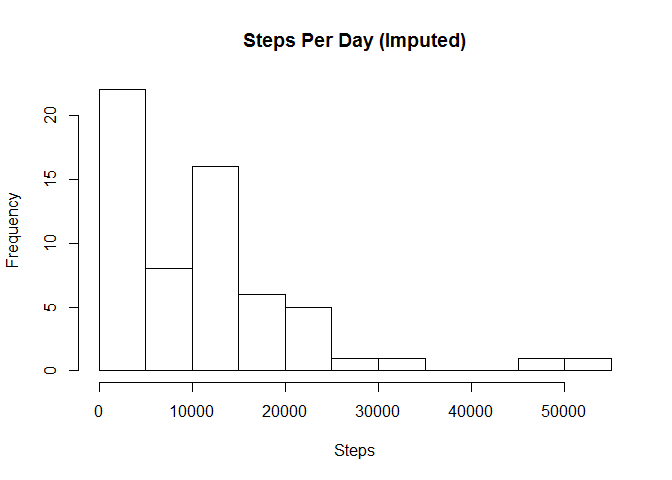
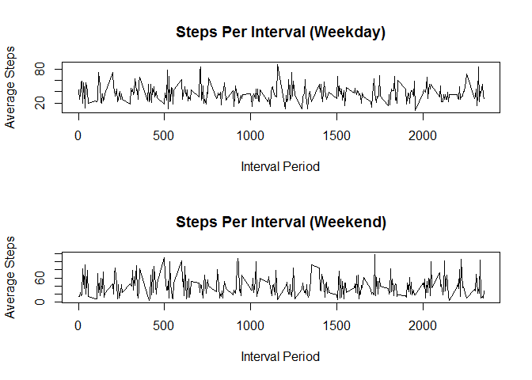

# Reproducible Research: Peer Assessment 1


## Loading and preprocessing the data
1) Load the data (i.e. read.csv())
2) Process/transform the data (if necessary) into a format suitable for your analysis


```r
subDir <- "data"
dataArchiveName <- "activity.zip"
dataFileName <- "activity.csv"

if(!file.exists(subDir)) {
  dir.create("data")
}
unzip(dataArchiveName,exdir=subDir)
activityData <- read.csv(file.path(subDir,dataFileName))
numRecords <- nrow(activityData)
```
Loaded 17568 records. Now glance at the data

```r
str(activityData)
```

```
## 'data.frame':	17568 obs. of  3 variables:
##  $ steps   : int  NA NA NA NA NA NA NA NA NA NA ...
##  $ date    : Factor w/ 61 levels "2012-10-01","2012-10-02",..: 1 1 1 1 1 1 1 1 1 1 ...
##  $ interval: int  0 5 10 15 20 25 30 35 40 45 ...
```
At first glance, we have some missing step data and the variable in an integer. The dates are factors. The interval starts at 0 with increments of 5.

## What is mean total number of steps taken per day?
For this part of the assignment, you can ignore the missing values in the dataset.

1) Calculate the total number of steps taken per day

```r
library(dplyr)
```

```
## Warning: package 'dplyr' was built under R version 3.4.3
```

```
## 
## Attaching package: 'dplyr'
```

```
## The following objects are masked from 'package:stats':
## 
##     filter, lag
```

```
## The following objects are masked from 'package:base':
## 
##     intersect, setdiff, setequal, union
```

```r
stepsByDate <- activityData %>% group_by(date) %>% summarise(n=sum(steps,na.rm = TRUE))
print(tbl_df(stepsByDate), n=nrow(stepsByDate))
```

```
## # A tibble: 61 x 2
##          date     n
##        <fctr> <int>
##  1 2012-10-01     0
##  2 2012-10-02   126
##  3 2012-10-03 11352
##  4 2012-10-04 12116
##  5 2012-10-05 13294
##  6 2012-10-06 15420
##  7 2012-10-07 11015
##  8 2012-10-08     0
##  9 2012-10-09 12811
## 10 2012-10-10  9900
## 11 2012-10-11 10304
## 12 2012-10-12 17382
## 13 2012-10-13 12426
## 14 2012-10-14 15098
## 15 2012-10-15 10139
## 16 2012-10-16 15084
## 17 2012-10-17 13452
## 18 2012-10-18 10056
## 19 2012-10-19 11829
## 20 2012-10-20 10395
## 21 2012-10-21  8821
## 22 2012-10-22 13460
## 23 2012-10-23  8918
## 24 2012-10-24  8355
## 25 2012-10-25  2492
## 26 2012-10-26  6778
## 27 2012-10-27 10119
## 28 2012-10-28 11458
## 29 2012-10-29  5018
## 30 2012-10-30  9819
## 31 2012-10-31 15414
## 32 2012-11-01     0
## 33 2012-11-02 10600
## 34 2012-11-03 10571
## 35 2012-11-04     0
## 36 2012-11-05 10439
## 37 2012-11-06  8334
## 38 2012-11-07 12883
## 39 2012-11-08  3219
## 40 2012-11-09     0
## 41 2012-11-10     0
## 42 2012-11-11 12608
## 43 2012-11-12 10765
## 44 2012-11-13  7336
## 45 2012-11-14     0
## 46 2012-11-15    41
## 47 2012-11-16  5441
## 48 2012-11-17 14339
## 49 2012-11-18 15110
## 50 2012-11-19  8841
## 51 2012-11-20  4472
## 52 2012-11-21 12787
## 53 2012-11-22 20427
## 54 2012-11-23 21194
## 55 2012-11-24 14478
## 56 2012-11-25 11834
## 57 2012-11-26 11162
## 58 2012-11-27 13646
## 59 2012-11-28 10183
## 60 2012-11-29  7047
## 61 2012-11-30     0
```
Some days have 0 or minimal steps though it may be due to missing data.

2) If you do not understand the difference between a histogram and a barplot, research the difference between them. Make a histogram of the total number of steps taken each day

```r
hist(stepsByDate$n, xlab = "Steps Per Day", main = "Frequency of Steps Per Day",breaks=10)
```

<!-- -->

Over a quarter of the days have daily steps in the 10,000 to 15,000 step range.

3) Calculate and report the mean and median of the total number of steps taken per day


```r
meanSteps <- format(mean(stepsByDate$n),scientific = FALSE)
medianSteps <- median(stepsByDate$n)
```
The mean is 9354.23 steps per day. The median is 10395 steps per day. The no or low step days seem to drag down the mean though the median is less impacted showing the higher likely closer to actual average.

## What is the average daily activity pattern?
1) Make a time series plot (i.e. type = "l") of the 5-minute interval (x-axis) and the average number of steps taken, averaged across all days (y-axis)


```r
stepsByInterval <- activityData %>% group_by(interval) %>% summarise(n=mean(steps,na.rm = TRUE))
plot(stepsByInterval,type="l",main="Steps Per Interval",xlab="Interval Period",ylab="Average Steps")
```

<!-- -->

As expected, the steps start on average after the subjects wake up. The steps in a single period are higher in the morning than the rest of the day.

2) Which 5-minute interval, on average across all the days in the dataset, contains the maximum number of steps?

```r
maxSteps <- max(activityData$steps,na.rm = TRUE)
```

The max steps in an interval is 806. This max occurs in the following period:

```r
notNullRows <- activityData[!is.na(activityData$steps),]
notNullRows[notNullRows$steps == maxSteps,]
```

```
##       steps       date interval
## 16492   806 2012-11-27      615
```

## Imputing missing values
Note that there are a number of days/intervals where there are missing values (coded as NA). The presence of missing days may introduce bias into some calculations or summaries of the data.

1) Calculate and report the total number of missing values in the dataset (i.e. the total number of rows with NAs)

```r
nullStepCount <- sum(is.na(activityData$steps))
```
In the data, there are 2304 values missing.

2) Devise a strategy for filling in all of the missing values in the dataset. The strategy does not need to be sophisticated. For example, you could use the mean/median for that day, or the mean for that 5-minute interval, etc.

We're going to replace the missing data with the average for that interval which we've
previously created.

3) Create a new dataset that is equal to the original dataset but with the missing data filled in.

I'm going to fill in empty values using the average steps for the interface across all dates of data.
Merge a copy of the dataframe with the average by interval. If the value is NA, then we use the average
value otherwise we use the original value.

```r
activityDataImputed <- activityData
sum(is.na(activityDataImputed$steps))
```

```
## [1] 2304
```

```r
mergedData = merge(activityDataImputed, stepsByInterval, by="interval",suffixes=c(".Orig", ".IntMean"))
activityDataImputed$steps = ifelse(is.na(mergedData$steps), mergedData$n, mergedData$steps)
imputedMissingStep <- sum(is.na(activityDataImputed$steps))
```
After imputing the data, there are now 0 step measurements which have an empty value.


4) Make a histogram of the total number of steps taken each day and Calculate and report the mean and median total number of steps taken per day. Do these values differ from the estimates from the first part of the assignment? What is the impact of imputing missing data on the estimates of the total daily number of steps?

```r
stepsByDateImputed <- activityDataImputed %>% group_by(date) %>% summarise(n=sum(steps))
hist(stepsByDateImputed$n,main="Steps Per Day (Imputed)",xlab="Steps",breaks=10)
```

<!-- -->

```r
meanImputedSteps <- format(mean(stepsByDateImputed$n),scientific = FALSE)
medianImputedSteps <- format(median(stepsByDateImputed$n),scientific = FALSE)
```
The mean went from originally 9354.23 to imputed value of 10766.19.
The median went from originally 10395 to imputed value of 10351.62. Imputing
the missing data increases the mean and median as steps are added for missing values. The right side of the histogran pushes out further to the right with a greater spread of higher valus.

## Are there differences in activity patterns between weekdays and weekends?
For this part the weekdays() function may be of some help here. Use the dataset with the filled-in missing values for this part.

1) Create a new factor variable in the dataset with two levels – “weekday” and “weekend” indicating whether a given date is a weekday or weekend day.

```r
dayOfWeek <- weekdays(as.Date(activityDataImputed$date))
weekend <- factor(ifelse(grepl("Saturday|Sunday",dayOfWeek),"weekend","weekday"))
activityDataImputed$weekend <- weekend
```

2) Make a panel plot containing a time series plot (i.e. type = "l") of the 5-minute interval (x-axis) and the average number of steps taken, averaged across all weekday days or weekend days (y-axis). See the README file in the GitHub repository to see an example of what this plot should look like using simulated data.

```r
activityDataImputedWeekday <- as.vector(activityDataImputed[activityDataImputed$weekend %in% c("weekday"),])
stepsByIntervalImputeWeekday <- activityDataImputedWeekday %>% group_by(interval) %>% summarise(n=mean(steps))

weekdayMean <- mean(activityDataImputedWeekday$steps)
weekdayMedian <- median(activityDataImputedWeekday$steps)

activityDataImputedWeekend <- as.vector(activityDataImputed[activityDataImputed$weekend %in% c("weekend"),])
stepsByIntervalImputeWeekend <- activityDataImputedWeekend %>% group_by(interval) %>% summarise(n=mean(steps))


weekendMean <- mean(activityDataImputedWeekend$steps)
weekendMedian <- median(activityDataImputedWeekend$steps)
```
Now let's plot:

```r
par(mfrow=c(2,1))
plot(stepsByIntervalImputeWeekday,type="l",main="Steps Per Interval (Weekday)",xlab="Interval Period",ylab="Average Steps")
plot(stepsByIntervalImputeWeekend,type="l",main="Steps Per Interval (Weekend)",xlab="Interval Period",ylab="Average Steps")
```

<!-- -->

The weekday mean is 36.8211158 and the median is 0.
The weekend mean is 38.9617728 and the median is 0.
